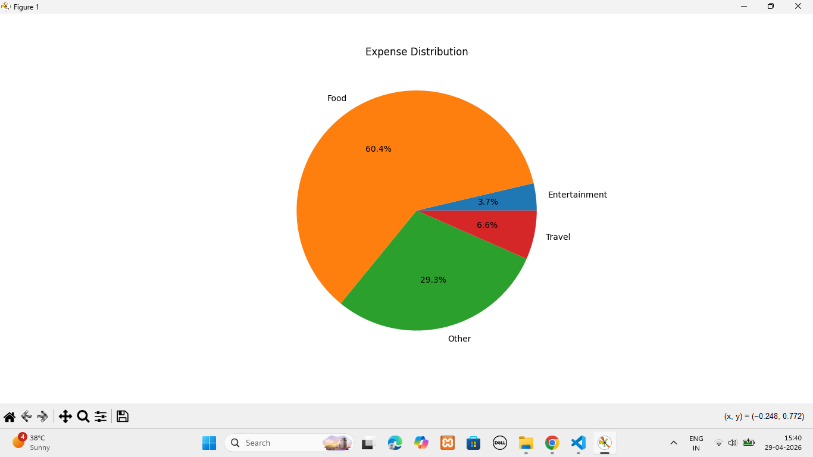

# AI Expense Tracker 💰🤖

Machine Learning powered expense prediction system using Python, Scikit-learn & Pandas.

### 🚀 Features:
1. **Expense Management** - CRUD operations via `manager.py`
2. **ML Prediction Engine** - `ai_model.py` uses Linear Regression to forecast spending
3. **Data Analysis** - Processes `data.csv` using Pandas for insights
4. **Data Visualization** - Matplotlib charts for expense trends
5. **CLI Interface** - Simple terminal app in `main.py`

### 🛠️ Tech Stack:
Python 3.10, Scikit-learn, Pandas, NumPy, Matplotlib

### 📸 Demo:


### 📊 Data Visualization:
**Expense Distribution Analysis**


### ⚙️ Setup:
```bash
git clone https://github.com/nikitaamreliya73-eng/AI-Expense-Tracker.git
cd AI-Expense-Tracker
pip install -r requirements.txt
python main.py

